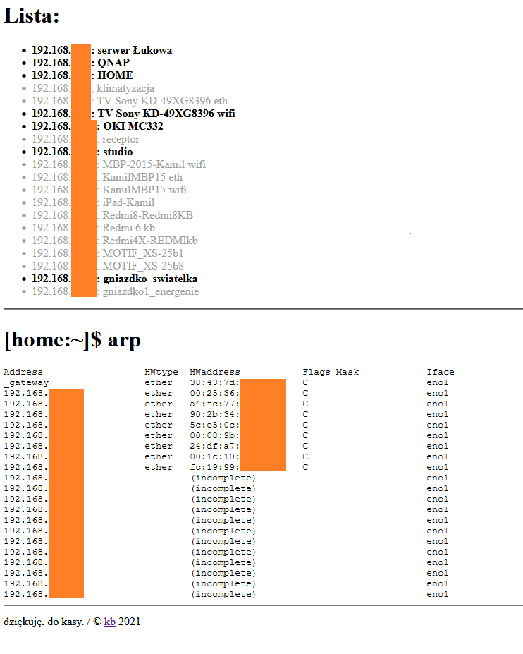

# tinyPingCheck
Pings devices to check if they exist on network; outputs HTML. Can use `/etc/udhcpd.conf` for `static_leases` lines and also `dnsmasq.conf` with `hosts`.

## Usage:
* copy `tpcConf.sample.php` to `tpcConf.php`
* edit `tpcConf.php`
* upload to the webserver
* launch `index.php` in your browser
* voila.

## Problems?
* `chmod u+s /bin/ping` (don't do that if /bin/ping is link to your /bin/busybox!)
* `chmod u+s /usr/sbin/arp`
* check if `shell_exec` isn't blocked on the server
* use debugCheck (`which ping`, `which arp`, `whoami`, etc)
* `chmod 777 /var/www/html/tinyPingCheck/temp`
